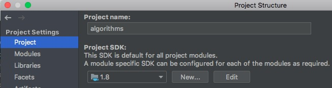
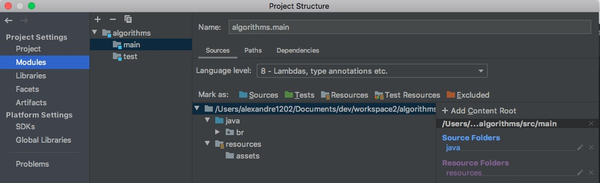

# Couple of examples of Java algorithm applications using Gradle, Mockito and JUnit in IntelliJ
If you are wondering about them try on the unit test in this [repo](https://github.com/Alexandre1202/algorithms) in src directory 
## Set up for MacOS
### [Git installation](https://gist.github.com/derhuerst/1b15ff4652a867391f03#file-mac-md)
### Clone this repository in your prefered workspace 
### [Java 8 download link](https://www.oracle.com/webapps/redirect/signon?nexturl=https://download.oracle.com/otn/java/jdk/8u241-b07/1f5b5a70bf22433b84d0e960903adac8/jdk-8u241-macosx-x64.dmg)
### [IntelliJ download link](https://www.jetbrains.com/education/download/download-thanks.html?platform=mac)
Run IntelliJ and open this project with IntelliJ. In IntelliJ select the name of the project **algorithms** and click on File / Project structure Menu and you will see some configurations. Configure them as following:



### [Homebrew installation](https://osxdaily.com/2018/03/07/how-install-homebrew-mac-os/)
### Gradle installation 
```
# brew install gradle
```
------------------------------------------
Talking about algorithms that I have learned: 
* [Buble Sort](https://en.wikipedia.org/wiki/Bubble_sort) - it has a poor performance.  

Unit tests are also available on this repository:


